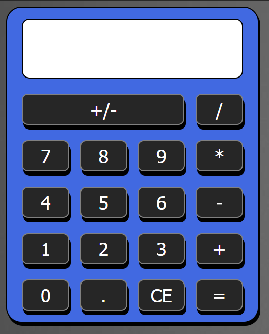

# Flexbox-Calculator
A simple calculator able to perform addition, subtraction, multiplication, division, and negation operations. 
Implemented using HTML, CSS (flexbox), and JavaScript. Used a dark grey background.

# Extra Features
- At most 10 characters displayed on the display at once.
- If number calculated is over 1000000, converts to scientific notation using at most 3 decimals.

# JSFiddle
Try it out with JSFiddle: https://jsfiddle.net/oz9a47h5/1/
